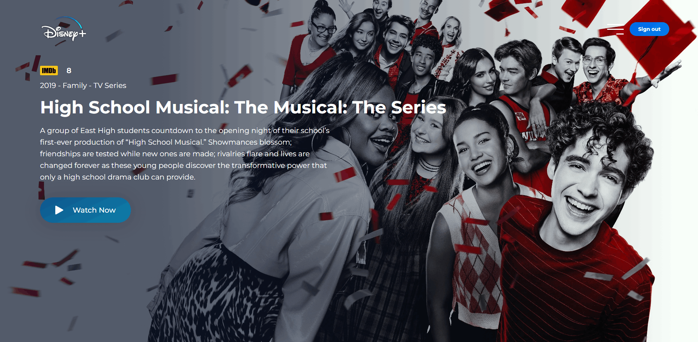

<h1 align="center">
  Disney Plus UI
</h1>



## Table of Contents

1. [Project Overview](#project-overview)  
2. [Technologies Used](#technologies-used)  
3. [Installation and Execution](#installation-and-execution)  
4. [Key Concepts Applied](#key-concepts-applied)  
5. [Movie & TV Show Catalog](#movie--tv-show-catalog)  
6. [Image Quality](#image-quality)  
7. [Contact](#contact)  


## Project Overview

Disney Plus UI is a professional project that replicates the Disney+ interface using semantic HTML, advanced CSS with global variables and responsive design, JavaScript for dynamic integration with the TMDB API, and high-quality movie posters and images dynamically fetched from TMDB. The application features a comprehensive catalog of 39 titles including Disney/Pixar films, Disney Channel originals, TV series, and the complete Spider-Man film collection, all organized in chronological release order with 4K UHD image quality.

## Technologies Used

- **HTML5**  
- **CSS3**  
- **JavaScript (ES6+)**  
- **TMDB API (The Movie Database)**
- **Montserrat Font** (Google Fonts)

## Key Features

- **Comprehensive Catalog**: 39 titles including Disney/Pixar films, Disney Channel Original Movies, TV series, and the complete Spider-Man film collection
- **Chronological Organization**: All titles organized by release date (1950-2024)
- **4K UHD Image Quality**: All images configured for 4K resolution (3840×2160) with automatic fallback
- **TV Series Support**: Full support for TV series with correct API endpoints and data mapping
- **Dynamic Content**: Titles, descriptions, ratings, and images dynamically fetched from TMDB API
- **Interactive Menu**: Responsive, easy-to-navigate menu with active film highlighting
- **Trailer Integration**: "Watch Now" button opens YouTube trailers in a modal
- **Image Fallback System**: Automatic fallback to lower resolutions if 4K unavailable
- **Responsive Design**: Optimized for various screen sizes
- **Smooth Transitions**: Fade-in and fade-out transitions for fluid navigation
- **Login System**: Basic authentication with sign up/sign in functionality
- **Password Visibility Toggle**: Show/hide password functionality with accessibility support

## Movie & TV Show Catalog

The application currently features a curated selection of **39 titles** organized chronologically by release date:

### Disney/Pixar Animation (10 titles)
- Cinderella (1950)
- Sleeping Beauty (1959)
- The Little Mermaid (1989)
- Beauty and the Beast (1991)
- The Lion King (1994)
- Toy Story (1995)
- Mulan (1998)
- Toy Story 2 (1999)
- Monsters, Inc. (2001)
- Big Hero 6 (2014)

### Spider-Man Collection (14 films)
- Spider-Man (2002)
- Spider-Man 2 (2004)
- Spider-Man 3 (2007)
- The Amazing Spider-Man (2012)
- The Amazing Spider-Man 2 (2014)
- Captain America: Civil War (2016)
- Spider-Man: Homecoming (2017)
- Avengers: Infinity War (2018)
- Spider-Man: Into the Spider-Verse (2018)
- Avengers: Endgame (2019)
- Toy Story 4 (2019)
- Spider-Man: Far From Home (2019)
- Spider-Man: No Way Home (2021)
- Spider-Man: Across the Spider-Verse (2023)

### Disney Channel Originals (9 titles)
- High School Musical (2006)
- Hannah Montana - TV Series (2006)
- Spider-Man 3 (2007)
- High School Musical 2 (2007)
- Camp Rock (2008)
- High School Musical 3 (2008)
- Bolt (2008)
- Hannah Montana: The Movie (2009)
- Glee - TV Series (2009)

### Additional Films (6 titles)
- Toy Story 3 (2010)
- Camp Rock 2: The Final Jam (2010)
- Teen Beach Movie (2013)
- Frozen (2013)
- Teen Beach Movie 2 (2015)
- Zootopia (2016)

### Recent Releases (6 titles)
- Spider-Man: Homecoming (2017)
- Avengers: Infinity War (2018)
- Spider-Man: Into the Spider-Verse (2018)
- Avengers: Endgame (2019)
- Frozen II (2019)
- Encanto (2021)
- Inside Out 2 (2024)

All movie and TV show data including titles, descriptions, ratings, and images are dynamically fetched from **The Movie Database (TMDB) API**.


## Image Quality

The project implements a comprehensive 4K UHD image quality system:

### Resolution Priority
- **Original**: Highest quality, no resolution limit (featured images)
- **w3840**: 4K UHD (3840×2160) for thumbnails
- **w1280**: HD fallback (1280×720)
- **w780**: SD fallback (780×440)

### Image Rendering
- `image-rendering: crisp-edges` for sharp details
- `image-rendering: high-quality` for professional visual quality
- Automatic fallback chain to ensure images always load
- Both movies and TV shows use identical 4K quality standards

### Quality Standards
- Excellent sharpness and high detail
- Realistic textures without pixelation or blur
- No compression artifacts
- Professional visual quality maintained across all content


## Installation and Execution

### 1. Clone the repository  
```bash
git clone https://github.com/NatashaBaudelaire/disneyplusui.git
```

### 2. Requirements  
- Code editor (e.g., Visual Studio Code)  
- Local server extension (e.g., Live Server)  
- Modern web browser

### 3. Run the project
1. Open the project folder in your code editor
2. Start a local server (e.g., using Live Server extension)
3. Open the application in your browser
4. Sign in or create an account to access the catalog

## Key Concepts Applied

- Semantic HTML5 structure
- API consumption using fetch()
- Dynamic DOM creation with createElement()
- Use of global CSS variables defined in :root
- Interactive menus with active item highlighting
- Image loading optimisation with 4K quality
- Automatic image fallback system
- TV series support with correct data mapping
- Chronological catalog organization
- Trailer integration with modal display
- Responsive design using media queries
- Smooth fade-in and fade-out transitions
- Login/logout system with form validation
- Password visibility toggle with accessibility
- Error handling and user feedback

## Contact

For questions, suggestions, or feedback, please open an issue on the repository or contact directly via GitHub.
